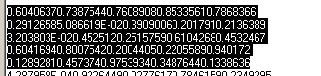



## Tab Function \- Block of Text  indent / un\-indent

### Description

To move (indent) block of selected text as one,

instead of one line at the time by using a TAB key. Just like you can select portion of your code in VB and move it as a block to the right.

Use TAB to indent

Use Shift+TAB to un-indent

UPDATED ON 06/14/02:

I've just added the UN-INDENT function as well :)
 
### More Info
 

             |
---                |---
**Submitted On**   |2002-06-14 01:01:46
**By**             |[Vladimir S\. Pekulas](https://github.com/Planet-Source-Code/PSCIndex/blob/master/ByAuthor/vladimir-s-pekulas.md)
**Level**          |Intermediate
**User Rating**    |4.0 (8 globes from 2 users)
**Compatibility**  |VB 3\.0, VB 4\.0 \(16\-bit\), VB 4\.0 \(32\-bit\), VB 5\.0, VB 6\.0
**Category**       |[String Manipulation](https://github.com/Planet-Source-Code/PSCIndex/blob/master/ByCategory/string-manipulation__1-5.md)
**World**          |[Visual Basic](https://github.com/Planet-Source-Code/PSCIndex/blob/master/ByWorld/visual-basic.md)
**Archive File**   |[Tab\_Functi942966142002\.zip](https://github.com/Planet-Source-Code/vladimir-s-pekulas-tab-function-block-of-text-indent-un-indent__1-35702/archive/master.zip)

